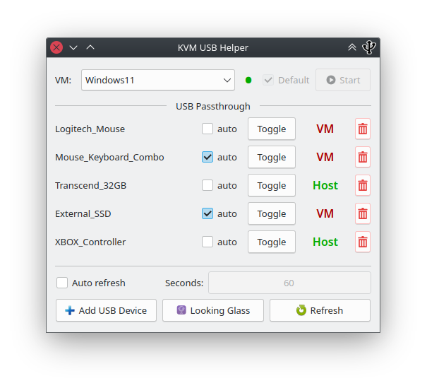

# KVM-USB-Helper
 
A simple gui written in Python (with PyQt6) to help you pass USB Devices back and forth between the host OS (Linux) and a running VM (in KVM/QEMU).

 
     
 The tool makes use of the `lsusb` command to list all available devices on the host OS, and uses the `virsh` command to comunicate with the VM.
 The VM's name you want the script to use must be written in the `vm_name` file in the root directory of the project.
 The script can be run with the `KVMHelper.sh` script.